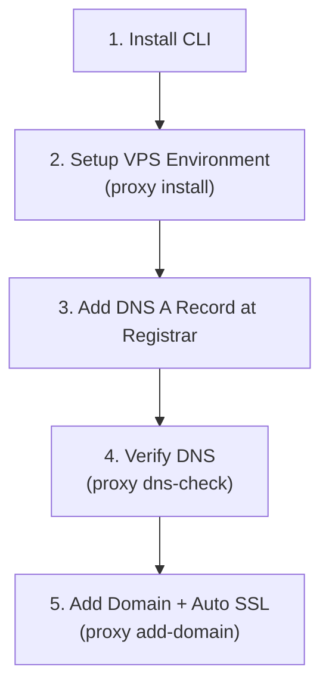

# nginx-proxy-helper 🔧

CLI tool to manage **Nginx Reverse Proxy + Let's Encrypt SSL Certbot** on your VPS using Docker Compose.

Automatically generates Nginx configurations, requests SSL certificates via Let's Encrypt, validates DNS records, auto-connects container networks, and handles automatic rollbacks on errors — all from a single command line interface.

---

## ✨ Features

| Command | Description |
|---------|-------------|
| `proxy add-domain` | Add a new main domain with automated SSL & optional `www` alias |
| `proxy add-subdomain` | Add a subdomain (supports certificate reuse or separate certs) |
| `proxy list` | List all active domains, proxy targets, and SSL certificate status |
| `proxy remove` | Remove domain configuration (optionally delete SSL certificates) |
| `proxy test` | Test Nginx configuration (`docker exec nginx nginx -t`) |
| `proxy reload` | Reload Nginx service (`docker exec nginx nginx -s reload`) |
| `proxy renew` | Renew all SSL certificates and reload Nginx |
| `proxy dns-check` | Check if domain A records point to your VPS IP |
| `proxy check` | Validate system dependencies (Docker, Python, network, containers) |
| `proxy auto-install` | Auto-install Docker/Compose, setup network, and launch containers |
| `proxy export` | Export standalone Nginx setup & certs to any folder (e.g. `/root/nginx-alpine`) |
| `proxy uninstall` | Interactive uninstaller (export to standalone or complete removal) |

---

## 📋 Prerequisites

- **Python** 3.8+
- **Docker** & **Docker Compose** v2 (or let `proxy install` install them automatically)
- **VPS** with a public IP address
- A domain name with DNS A records pointing to your VPS IP

---

## 🚀 Recommended Step-by-Step Setup Guide

Follow these recommended stages for a seamless setup on a fresh VPS:



### Stage 1: Install `nginx-proxy-helper`

Run the one-line installer on your VPS or local terminal:

```bash
/bin/bash -c "$(curl -fsSL https://raw.githubusercontent.com/mhiqrambg/nginx-proxy-helper/main/install.sh)"
```

*This automatically clones the repo to `~/.nginx-proxy-helper`, sets up a virtual environment, installs dependencies, and configures the `proxy` command in your PATH.*

### Stage 2: Initialize VPS Environment

Run `proxy install` to prepare the environment automatically:

```bash
proxy install
```

This single command will:
- Install Docker & Docker Compose if missing (Linux)
- Ensure Docker daemon is running
- Create the external Docker network `nginx-network`
- Start Nginx and Certbot containers in `~/.nginx-proxy-helper/nginx-alpine`

### Stage 3: Add DNS A Record in Domain Registrar

In your domain registrar dashboard (Cloudflare, Namecheap, GoDaddy, etc.), add an **A Record**:

| Type | Name / Host | Value / Target | TTL |
|:---|:---|:---|:---|
| **A** | `@` (or subdomain like `api`) | `YOUR_VPS_IP` | Auto / 3600 |
| **A** | `www` (optional) | `YOUR_VPS_IP` | Auto / 3600 |

*(If using Cloudflare, temporarily set proxy mode to **DNS Only / Gray Cloud** during initial SSL verification).*

### Stage 4: Verify DNS Propagation

Check if your domain points correctly to your VPS:

```bash
proxy dns-check example.com
```

Ensure the status shows `✅ Match`.

### Stage 5: Add Domain & Automatic SSL

Run `proxy add-domain` to generate Nginx configs and obtain SSL certificates automatically:

```bash
# Target container on nginx-network
proxy add-domain example.com --target myapp:3000 --www

# Or target host service
proxy add-domain example.com --target host.docker.internal:8080 --www
```

---

## 📖 Installation & Updates

### Quick Install (Recommended)

```bash
/bin/bash -c "$(curl -fsSL https://raw.githubusercontent.com/mhiqrambg/nginx-proxy-helper/main/install.sh)"
```

### Manual Install

```bash
git clone https://github.com/mhiqrambg/nginx-proxy-helper.git
cd nginx-proxy-helper
python3 -m venv .venv
source .venv/bin/activate
pip install -e .
```

### Update CLI

```bash
/bin/bash -c "$(curl -fsSL https://raw.githubusercontent.com/mhiqrambg/nginx-proxy-helper/main/update.sh)"
```

### Uninstall

```bash
/bin/bash -c "$(curl -fsSL https://raw.githubusercontent.com/mhiqrambg/nginx-proxy-helper/main/uninstall.sh)"
```

---

## 💻 Detailed Usage

### Add Main Domain

```bash
# Main domain with SSL & www redirect
proxy add-domain example.com --target app:3000 --www

# With email address for Let's Encrypt notifications
proxy add-domain example.com --target app:3000 --email admin@example.com

# Force overwrite existing configuration
proxy add-domain example.com --target app:3000 --force
```

**Automated 5-Step Workflow:**
1. ✅ **DNS Validation**: Verifies A record points to your VPS IP
2. ✅ **Target Inspection**: Validates & auto-connects target container to `nginx-network`
3. ✅ **HTTP Challenge Config**: Deploys temporary HTTP config for ACME validation
4. ✅ **SSL Certificate Request**: Requests SSL certificate via Certbot container
5. ✅ **SSL Proxy Config**: Deploys production SSL config & reloads Nginx

### Add Subdomain

```bash
# Reuse parent domain certificate (default)
proxy add-subdomain api.example.com --target api-service:8080

# Request separate SSL certificate
proxy add-subdomain blog.example.com --target ghost:2368 --separate-cert
```

### List Active Domains

```bash
proxy list
```

Example Output:
```
┌───┬─────────────────┬─────────────────┬──────────────┬─────┬────────────────────┐
│ # │ Domain          │ Server Names    │ Target       │ SSL │ Certificate Status │
├───┼─────────────────┼─────────────────┼──────────────┼─────┼────────────────────┤
│ 1 │ example.com     │ example.com     │ app:3000     │ 🔒  │ 🟢 Valid (89 days) │
│ 2 │ api.example.com │ api.example.com │ api:8080     │ 🔒  │ 🟢 Valid (89 days) │
└───┴─────────────────┴─────────────────┴──────────────┴─────┴────────────────────┘
```

### Remove Domain

```bash
# Remove Nginx configuration file
proxy remove example.com

# Remove configuration file and SSL certificate
proxy remove example.com --remove-cert
```

### Test & Reload Nginx

```bash
# Test Nginx configuration syntax (docker exec nginx nginx -t)
proxy test

# Reload Nginx service (docker exec nginx nginx -s reload)
proxy reload
```

### Check System & Dependencies

```bash
proxy check
```

Output:
```
🔍 System Dependencies

┌──────────────────────┬──────────┬──────────────────────────┬──────────┐
│ Component            │  Status  │ Details                  │ Required │
├──────────────────────┼──────────┼──────────────────────────┼──────────┤
│ Python               │    ✅    │ Python 3.12.3            │   Yes    │
│ Docker               │    ✅    │ Docker version 28.0.1    │   Yes    │
│ OpenSSL              │    ✅    │ OpenSSL 3.0.13           │    No    │
│ curl                 │    ✅    │ curl 8.5.0               │    No    │
│ Docker Compose       │    ✅    │ v2.27.0                  │   Yes    │
└──────────────────────┴──────────┴──────────────────────────┴──────────┘

🐳 Docker Status

┌──────────────────────┬──────────┬─────────┐
│ Component            │  Status  │ Details │
├──────────────────────┼──────────┼─────────┤
│ Docker Daemon        │    ✅    │ Running │
│ nginx-network        │    ✅    │ Exists  │
│ Container: nginx     │    ✅    │ Running │
│ Container: certbot   │    ✅    │ Running │
└──────────────────────┴──────────┴─────────┘

🐍 Python Packages

┌──────────────────────┬──────────┬─────────┐
│ Package              │  Status  │ Version │
├──────────────────────┼──────────┼─────────┤
│ click                │    ✅    │ 8.4.2   │
│ Jinja2               │    ✅    │ 3.1.6   │
│ dnspython            │    ✅    │ 2.8.0   │
│ rich                 │    ✅    │ 15.0.0  │
│ tabulate             │    ✅    │ 0.10.0  │
└──────────────────────┴──────────┴─────────┘

✅ All critical dependencies are satisfied!
```

---

## ⏰ Auto-Renewal Crontab Setup

### Method 1: Interactive Assistant

```bash
proxy renew --setup-cron
```

### Method 2: Manual Crontab Setup

Make script executable and add to crontab (runs daily at 3:00 AM):

```bash
chmod +x scripts/renew-certs.sh
crontab -e
```

Add this line:
```cron
0 3 * * * /path/to/nginx-proxy-helper/scripts/renew-certs.sh >> /var/log/certbot-renew.log 2>&1
```

Or using `proxy renew` command directly:
```cron
0 3 * * * cd /path/to/nginx-proxy-helper && proxy renew >> /var/log/certbot-renew.log 2>&1
```

---

## 📁 Project Structure

```
nginx-proxy-helper/
├── pyproject.toml              # Package config & dependencies
├── README.md                   # Documentation
├── install.sh                  # One-line installer
├── update.sh                   # One-line updater
├── uninstall.sh                # Uninstaller
│
├── nginx_proxy_helper/         # Source code
│   ├── cli.py                  # CLI entrypoint (Click subcommands)
│   ├── config.py               # Paths, discovery & settings
│   ├── lib/
│   │   ├── certbot.py          # Certbot SSL certificate manager
│   │   ├── nginx.py            # Nginx config generator & backup/rollback
│   │   ├── dns.py              # DNS resolution & validation
│   │   ├── docker.py           # Docker exec & network auto-connect
│   │   ├── checker.py          # Dependency status scanner
│   │   └── installer.py        # Automated VPS Docker environment setup
│   └── templates/
│       ├── http_challenge.conf.j2  # Temporary ACME challenge template
│       └── ssl_proxy.conf.j2       # Production SSL reverse proxy template
│
├── nginx-alpine/               # Docker Compose setup
│   ├── docker-compose.yml
│   ├── nginx/conf.d/           # Generated Nginx config files
│   │   └── 00-default.conf     # Catch-all HTTP/HTTPS 404 fallback server
│   ├── nginx/ssl/              # Fallback dummy self-signed SSL certs
│   └── certbot/{conf,www}      # Shared Certbot webroot & live certs
│
└── scripts/
    └── renew-certs.sh          # Crontab auto-renewal script
```

---

## 🔧 Customizing Nginx Templates

Templates are located in `nginx_proxy_helper/templates/`:

- **`http_challenge.conf.j2`** — Temporary HTTP config for ACME challenge validation
- **`ssl_proxy.conf.j2`** — Production SSL reverse proxy with HTTP2, HSTS, and WebSocket support

Available Jinja2 template variables:
- `{{ domain }}` — Domain name
- `{{ target }}` — Target proxy address (`container:port` or `host.docker.internal:port`)
- `{{ www }}` — Boolean, whether to include `www.domain` alias
- `{{ cert_domain }}` — Certificate directory name under Let's Encrypt

---

## 🐛 Troubleshooting

### DNS Not Propagated
```
✗ Domain 'example.com' DOES NOT point to this VPS!
```
→ Wait 5-30 minutes after updating DNS records at your registrar, then retry.

### Target Container Not Found
```
⚠ Target container 'myapp' is not connected to 'nginx-network'.
```
→ Run `docker network connect nginx-network myapp` or let `proxy add-domain` auto-connect it.

### Certbot Failure
→ Configs are automatically rolled back to prevent broken states.
→ Ensure port 80 & 443 are publicly accessible and not blocked by VPS firewall (UFW/iptables).

---

## 📄 License

MIT
